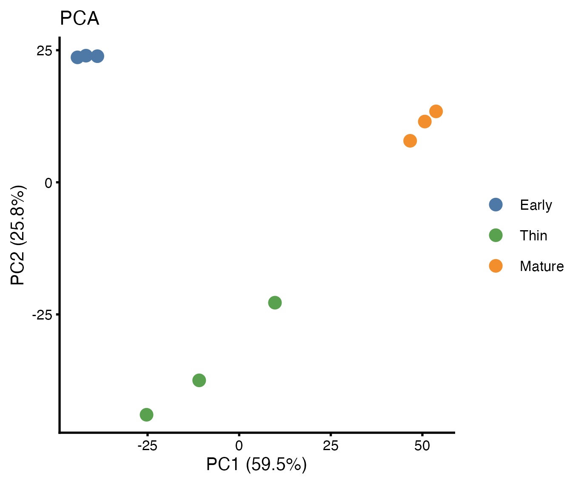
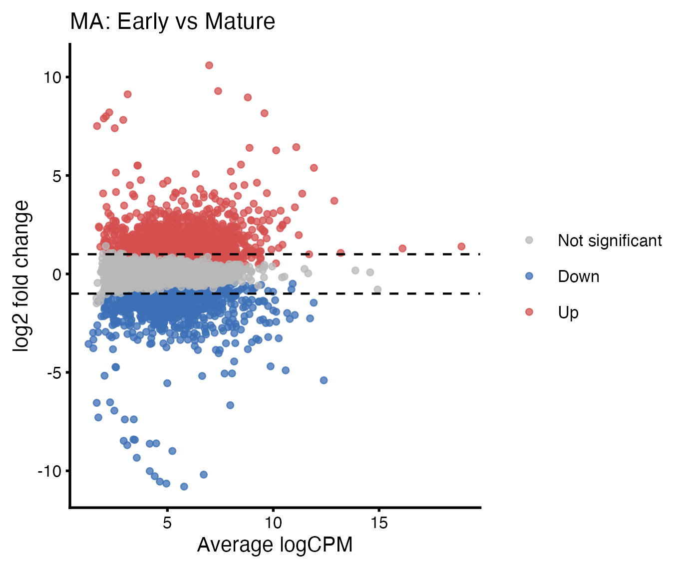
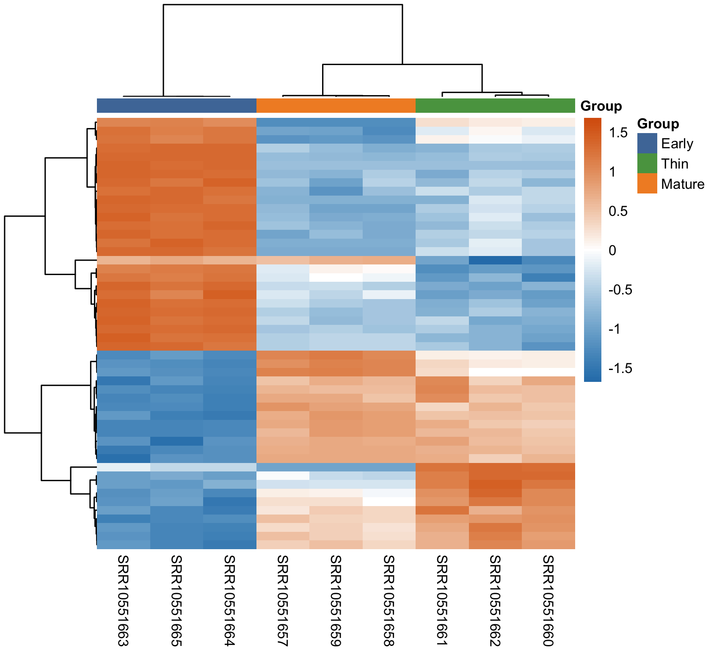
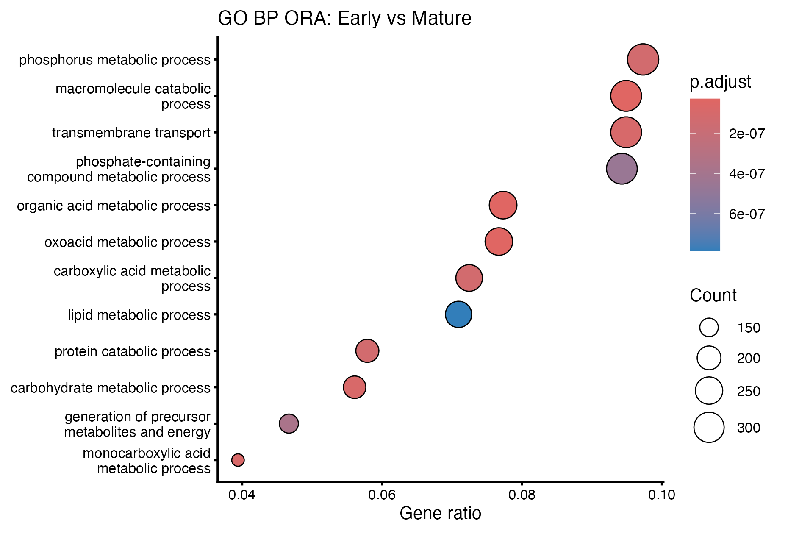

# BINF*6110 Assignment 2
## Transcriptomic Analysis of Saccharomyces cerevisiae Biofilm Development Reveals Stage-Specific Metabolic Reprogramming


## Introduction

Biofilm formation in *Saccharomyces cerevisiae* is a structured developmental process in which cells transition through distinct physiological states in response to environmental changes (Speranza et al., 2020). During fermentation-associated biofilm maturation, yeast cells experience shifts in nutrient availability, ethanol concentration, and metabolic byproducts (Speranza et al., 2020). These environmental changes are expected to drive coordinated transcriptional reprogramming. Understanding stage-specific gene expression patterns provides insight into how yeast adapts to prolonged fermentation conditions and resource limitation.

RNA sequencing (RNA-seq) enables genome-wide characterization of transcriptional changes across biological conditions. In this study, publicly available RNA-seq data from Early, Thin, and Mature biofilm stages were analyzed to identify differentially expressed genes and enriched biological processes (Mardanov et al., 2020). The primary objective was to determine how transcriptional programs shift during biofilm maturation and whether these changes reflect metabolic and physiological adaptation.

Transcript abundance was quantified using Salmon, a pseudo-alignment method that estimates transcript-level expression without performing full genome alignment (Patro et al., 2017). Compared to traditional alignment-based approaches, pseudo-aligners are computationally efficient while maintaining comparable accuracy for differential expression analysis in well-annotated organisms (Sarantopoulou et al., 2021). However, pseudo-alignment relies on a high-quality reference transcriptome and is not designed for detecting novel splice variants (Borozan et al., 2023). Given that *S. cerevisiae* has a well-characterized genome and limited alternative splicing, this approach is appropriate for the present study.

Differential expression was assessed using a negative binomial generalized linear modeling framework, which accounts for biological variability in RNA-seq count data. Alternative tools such as DESeq2 or limma-voom implement similar dispersion-based modeling strategies, but all rely on comparable statistical assumptions regarding count-based variability (Buratin et al., 2023). Functional interpretation was conducted using Gene Ontology over-representation analysis (ORA), which identifies biological processes enriched among significantly differentially expressed genes (Sarantopoulou et al., 2021). While gene set enrichment analysis (GSEA) can detect more subtle coordinated shifts, ORA provides clear interpretation of strongly regulated pathways and is suitable for identifying major stage-specific functional changes (Smith et al., 2026).

Together, this framework enables systematic characterization of transcriptional remodeling across biofilm development while balancing computational efficiency, statistical rigor, and interpretability.


## Methods

RNA-seq datasets corresponding to Early, Thin, and Mature biofilm stages of *Saccharomyces cerevisiae* were obtained from the NCBI Sequence Read Archive (BioProject PRJNA592304) (Mardanov et al., 2020). Raw sequencing reads were downloaded using the SRA Toolkit (v3.0.9) and converted to FASTQ format using fasterq-dump with eight threads (SRA Toolkit Development Team, n.d.).

Transcript abundance was quantified using Salmon (v1.10.2), a pseudo-alignment–based method that enables accurate transcript-level quantification without performing full genome alignment (Patro et al., 2017). The *S. cerevisiae* reference transcriptome (Ensembl release 115, R64-1-1 cDNA FASTA) was used to construct the Salmon index (Saccharomyces_cerevisiae - Ensembl Genome Browser 115, n.d.). Quantification was performed with automatic library-type detection (```-l A```) and parallel processing (```-p 8```), while all other parameters were left at default settings.

Quality control was assessed at both the quantification and expression levels. Salmon mapping statistics were examined to confirm high mapping rates and appropriate library-type inference. At the expression level, principal component analysis (PCA) of normalized expression values was used to evaluate replicate clustering and detect potential outliers. No samples were removed from downstream analysis.

Transcript-level quantifications were imported into R (v4.5.1) using tximport (v1.36.1) and analyzed with edgeR (v4.6.3) (Chen et al., 2025; Soneson et al., 2015). Lowly expressed transcripts were filtered using filterByExpr, and normalization was performed using the trimmed mean of M-values (TMM) method. Differential expression was assessed within a negative binomial generalized linear modeling framework. Pairwise contrasts were performed between Early vs Thin, Early vs Mature, and Thin vs Mature developmental stages. Statistical significance was determined using likelihood ratio tests with Benjamini–Hochberg false discovery rate (FDR) correction, and transcripts with FDR < 0.05 were considered significantly differentially expressed.

Functional interpretation was conducted using Gene Ontology (GO) Biological Process enrichment analysis implemented in clusterProfiler (v4.16.0) (Xu et al., 2024). Over-representation analysis (ORA) was performed on significantly differentially expressed genes for each contrast using the hypergeometric test, with Benjamini-Hochberg correction applied to control for multiple testing. Enriched GO terms with adjusted p-values < 0.05 were considered significant. All analyses and visualizations were performed in R using ggplot2 (v4.0.2) and pheatmap (v1.0.13), and the complete analysis scripts are provided in the accompanying repository (Ggplot2: Elegant Graphics for Data Analysis (3e), n.d.; Kolde, 2010).


## Results

### Global transcriptomic structure across developmental


**Figure 1. Principal component analysis of normalized transcript expression across biofilm stages.**  
PCA was performed on logCPM-transformed expression values. PC1 and PC2 explain 59.5% and 25.8% of total variance, respectively. Samples cluster by developmental stage (Early, Thin, Mature), indicating strong stage-specific transcriptional structure and high reproducibility among biological replicates.

To evaluate overall transcriptomic variation across biofilm stages, principal component analysis (PCA) was performed on normalized logCPM expression values. The first two principal components explained 59.5% and 25.8% of the total variance, respectively (Figure 1). Samples clustered distinctly according to developmental stage, with Early and Mature biofilms separated primarily along PC1, while Thin biofilms occupied an intermediate position. Replicates within each group clustered tightly, indicating strong reproducibility and minimal within-group variability. These results demonstrate that developmental stage is the dominant driver of transcriptional variation in this dataset.

### Differential expression reveals extensive transcriptional remodeling


**Figure 2. MA plot of differential expression between Early and Mature biofilm stages.**  
Each point represents a transcript. The x-axis shows average expression (logCPM), and the y-axis shows log2 fold change (Mature vs Early). Red points indicate transcripts with FDR < 0.05. Extensive transcriptional remodeling is observed across a wide dynamic range of expression levels.

Differential expression analysis was conducted using a negative binomial generalized linear model framework in edgeR. Pairwise comparisons revealed widespread transcriptional changes between developmental stages. A total of 2,629 transcripts were significantly differentially expressed between Early and Thin stages, 3,504 between Early and Mature stages, and 2,909 between Thin and Mature stages (FDR < 0.05).

The Early vs Mature comparison showed the most pronounced transcriptional divergence and was therefore selected as a representative contrast. The MA plot (Figure 2) illustrates substantial fold changes across a broad range of expression levels, with numerous transcripts exhibiting large positive and negative log2 fold changes. Differential expression was observed across both moderately and highly expressed transcripts, indicating global transcriptomic restructuring during biofilm maturation.

### Stage-specific expression patterns of top differentially expressed genes


**Figure 3. Heatmap of the top 50 differentially expressed transcripts.**  
Row-scaled expression values (logCPM) are shown for the most significantly differentially expressed transcripts. Samples cluster by developmental stage, revealing distinct stage-specific transcriptional programs and progressive expression changes from Early to Mature biofilms.

To visualize coordinated expression patterns, the top 50 differentially expressed transcripts (Early vs Mature contrast) were plotted in a clustered heatmap (Figure 3). Hierarchical clustering separated samples by developmental stage, confirming the robustness of stage-specific expression signatures. Transcripts highly expressed in Early biofilms were generally downregulated in Mature biofilms, while a distinct subset showed increased expression during maturation. Thin biofilms exhibited intermediate expression patterns, consistent with a transitional developmental state.

These results further support progressive transcriptional reprogramming across biofilm development.

### Functional enrichment analysis indicates metabolic reprogramming



To determine the biological processes underlying differential expression, Gene Ontology (GO) Biological Process over-representation analysis was performed for each contrast. The Early vs Mature comparison exhibited strong enrichment of metabolic and transport-related processes (Figure 4), including phosphorus metabolic process, phosphate-containing compound metabolism, transmembrane transport, and macromolecule catabolic processes.

These enriched categories suggest substantial metabolic restructuring and nutrient adaptation during biofilm maturation. Together with the differential expression results, these findings indicate coordinated transcriptional remodeling associated with biofilm development and environmental adaptation.


## Discussion

This study demonstrates extensive stage-specific transcriptional remodeling during *Saccharomyces cerevisiae* biofilm development. Global transcriptomic structure, differential expression analysis, and functional enrichment collectively indicate progressive metabolic and physiological reprogramming from Early to Mature biofilms.

The large number of differentially expressed transcripts, particularly in the Early vs Mature comparison, suggests that biofilm maturation involves a substantial shift in cellular state. Early biofilms exhibited expression patterns consistent with active growth and biosynthetic activity, while Mature biofilms showed enrichment of pathways associated with metabolic adaptation and nutrient stress. This pattern aligns with previous observations that yeast cells in structured communities undergo transcriptional transitions as environmental conditions change (Gasch et al., 2000; Lackner et al., 2012).

Functional enrichment analysis revealed significant over-representation of phosphorus metabolic processes, phosphate-containing compound metabolism, and transmembrane transport in Mature biofilms. Phosphate metabolism plays a central role in cellular energy balance and stress adaptation, particularly under nutrient limitation (Bharatula & Broach, 2018). Upregulation of transport-related processes may reflect increased scavenging and redistribution of nutrients within the biofilm structure, consistent with spatial heterogeneity observed in yeast colonies (Binder et al., 2015).

Several highly differentially expressed transcripts further support this interpretation. Genes associated with metabolic remodeling and stress response are known to become activated under conditions of nutrient depletion and environmental stress. For example, previous studies have shown that transcriptional changes during biofilm formation often involve shifts in carbohydrate metabolism, mitochondrial function, and stress-responsive pathways (Moreno-García et al., 2016; Vyas et al., 2005). The magnitude of fold changes observed in the Early vs Mature contrast suggests coordinated regulation rather than stochastic transcriptional drift.

The Thin stage exhibited intermediate transcriptional profiles, both in PCA positioning and expression heatmaps, supporting its role as a transitional developmental state. This progressive pattern is consistent with models of biofilm maturation in which cells shift from proliferation-dominated states to metabolically specialized and stress-adapted states (Brückner & Mösch, 2012). Such transitions may facilitate survival under ethanol accumulation, oxidative stress, and nutrient exhaustion during fermentation.

It is important to note several methodological considerations. The use of pseudo-alignment (Salmon) provides efficient and accurate transcript quantification in well-annotated organisms such as *S. cerevisiae*; however, this approach does not detect novel splice variants or structural rearrangements. Additionally, over-representation analysis (ORA) focuses on strongly differentially expressed genes and may overlook coordinated but subtle pathway-level shifts that gene set enrichment analysis (GSEA) could capture. Despite these limitations, the consistency between differential expression patterns and enriched functional categories supports the robustness of the conclusions.

Overall, the results indicate that yeast biofilm maturation involves coordinated transcriptional reprogramming associated with metabolic restructuring, nutrient adaptation, and environmental stress response. These findings contribute to understanding the molecular basis of biofilm development in fermentation-associated conditions and highlight key biological processes underlying stage-specific adaptation.


## References

Bharatula, V., & Broach, J. R. (2018).       
The Nutrient Stress Response in Yeast. In M. Skoneczny (Ed.),   
*Stress Response Mechanisms in Fungi: Theoretical and Practical Aspects* (pp. 131–159). Springer International Publishing.   
https://doi.org/10.1007/978-3-030-00683-9_4

Binder, B. J., Sundstrom, J. F., Gardner, J. M., Jiranek, V., & Oliver, S. G. (2015).   
Quantifying Two-Dimensional Filamentous and Invasive Growth Spatial Patterns in Yeast Colonies.   
*PLOS Computational Biology*, 11(2), e1004070.   
https://doi.org/10.1371/journal.pcbi.1004070

Borozan, L., Rojas Ringeling, F., Kao, S.-Y., Nikonova, E., Monteagudo-Mesas, P., Matijević, D., Spletter, M. L., & Canzar, S. (2023).   
Counting pseudoalignments to novel splicing events.   
*Bioinformatics*, 39(7), btad419.   
https://doi.org/10.1093/bioinformatics/btad419

Brückner, S., & Mösch, H.-U. (2012).  
Choosing the right lifestyle: Adhesion and development in *Saccharomyces cerevisiae*. 
*FEMS Microbiology Reviews*, 36(1), 25–58.  
https://doi.org/10.1111/j.1574-6976.2011.00275.x

Buratin, A., Bortoluzzi, S., & Gaffo, E. (2023).  
Systematic benchmarking of statistical methods to assess differential expression of circular RNAs.  
*Briefings in Bioinformatics*, 24(1), bbac612.  
https://doi.org/10.1093/bib/bbac612

Chen, Y., Chen, L., Lun, A. T. L., Baldoni, P. L., & Smyth, G. K. (2025).  
edgeR v4: Powerful differential analysis of sequencing data with expanded functionality and improved support for small counts and larger datasets.   
*Nucleic Acids Research*, 53(2), gkaf018.  
https://doi.org/10.1093/nar/gkaf018

Gasch, A. P., Spellman, P. T., Kao, C. M., Carmel-Harel, O., Eisen, M. B., Storz, G., Botstein, D., & Brown, P. O. (2000).   
Genomic Expression Programs in the Response of Yeast Cells to Environmental Changes.  
Molecular Biology of the Cell, 11(12), 4241–4257.   
https://doi.org/10.1091/mbc.11.12.4241

ggplot2: Elegant Graphics for Data Analysis (3e). (n.d.).  
Retrieved March 1, 2026,  
from https://ggplot2-book.org/

Kolde, R. (2010).  
*pheatmap: Pretty Heatmaps* (p. 1.0.13) [Dataset].   
https://doi.org/10.32614/CRAN.package.pheatmap

Lackner, D. H., Schmidt, M. W., Wu, S., Wolf, D. A., & Bähler, J. (2012).  
Regulation of transcriptome, translation, and proteome in response to environmental stress in fission yeast.  
*Genome Biology*, 13(4), R25.  
https://doi.org/10.1186/gb-2012-13-4-r25

Mardanov, A. V., Eldarov, M. A., Beletsky, A. V., Tanashchuk, T. N., Kishkovskaya, S. A., & Ravin, N. V. (2020).  
Transcriptome Profile of Yeast Strain Used for Biological Wine Aging Revealed Dynamic Changes of Gene Expression in Course of Flor Development.  
*Frontiers in Microbiology*, 11, 538.  
https://doi.org/10.3389/fmicb.2020.00538

Moreno-García, J., Mauricio, J. C., Moreno, J., & García-Martínez, T. (2016).  
Stress responsive proteins of a flor yeast strain during the early stages of biofilm formation.  
*Process Biochemistry*, 51(5), 578–588.   
https://doi.org/10.1016/j.procbio.2016.02.011

Patro, R., Duggal, G., Love, M. I., Irizarry, R. A., & Kingsford, C. (2017).  
Salmon provides fast and bias-aware quantification of transcript expression.  
*Nature Methods*, 14(4), 417–419.  
https://doi.org/10.1038/nmeth.4197

Saccharomyces_cerevisiae—Ensembl genome browser 115. (n.d.).  
Retrieved March 1, 2026,   
from https://www.ensembl.org/Saccharomyces_cerevisiae/Info/Index

Sarantopoulou, D., Brooks, T. G., Nayak, S., Mrčela, A., Lahens, N. F., & Grant, G. R. (2021).  
Comparative evaluation of full-length isoform quantification from RNA-Seq.  
*BMC Bioinformatics*, 22, 266.   
https://doi.org/10.1186/s12859-021-04198-1

Smith, M. A., Natarajan, E., Lizama-Valenzuela, C., Arnold, T., Stroud, D., Larpthaveesarp, A., Alvira, C., Fineman, J. R., Ferriero, D. M., Maltepe, E., Gonzalez, F., & Mike, J. K. (2026).   
Temporal and Spatial Gene Expression Dynamics in Neonatal HI Hippocampus with Focus on Arginase.   
*Cells*, 15(3), 253.   
https://doi.org/10.3390/cells15030253

Soneson, C., Love, M. I., & Robinson, M. D. (2015).  
Differential analyses for RNA-seq: Transcript-level estimates improve gene-level inferences.  
F1000Research, 4, 1521.  
https://doi.org/10.12688/f1000research.7563.2

Speranza, B., Corbo, M. R., Campaniello, D., Altieri, C., Sinigaglia, M., & Bevilacqua, A. (2020).   
Biofilm formation by potentially probiotic Saccharomyces cerevisiae strains.   
*Food Microbiology*, 87, 103393.     
https://doi.org/10.1016/j.fm.2019.103393

SRA Toolkit Development Team. (n.d.).  
SRA Toolkit.  
Retrieved https://trace.ncbi.nlm.nih.gov/Traces/sra/sra.cgi?view=software

Vyas, V. K., Berkey, C. D., Miyao, T., & Carlson, M. (2005).  
Repressors Nrg1 and Nrg2 Regulate a Set of Stress-Responsive Genes in Saccharomyces cerevisiae.  
*Eukaryotic Cell*, 4(11), 1882–1891.  
https://doi.org/10.1128/ec.4.11.1882-1891.2005

Xu, S., Hu, E., Cai, Y., Xie, Z., Luo, X., Zhan, L., Tang, W., Wang, Q., Liu, B., Wang, R., Xie, W., Wu, T., Xie, L., & Yu, G. (2024).  
Using clusterProfiler to characterize multiomics data.  
*Nature Protocols*, 19(11), 3292–3320.  
https://doi.org/10.1038/s41596-024-01020-z


